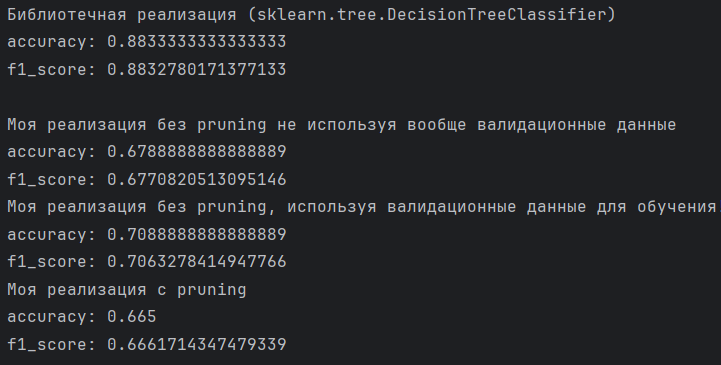

Лабораторная работа №1. Логическая классификация.
1)	Был выбран синтетический data set с Kaggle об успеваемости студентов. Таргет завершит ли студент онлайн курс. 9000 строк данных!
https://www.kaggle.com/datasets/rabieelkharoua/predict-online-course-engagement-dataset?resource=download
Категориальный признак, какой курс будет завершен здесь есть.
Остальные числовые.
Для нашего алгоритма, мы так же переведем Device Type в категориальный отдельно, т.к у него всего 2 значения и его можно считать категориальным. Не стоит применять к нему наш специальный алгоритм по превращению числовые признаков в категориальные.
Пропуски создаются искусственно! Изначально в дата сете их нет.

2)	Построено ID3 дерево с критерием Джинни.
Дерево является бинарным. Бинарные признаки просто разделяются на 2 части. Для категориальных признаков перебираются различные варианты разбиения на 2 группы. Это реализовано немного в упрощенном формате, одна категория, против остальных (не перебираются все возможные варианты распределения значений категориального признака по группам). Для числовых признаков подбирается порог treshold, по которому данные будут разбиты на 2 части. 

3)	Пропущенные значения обработаны так, что, когда мы в вершине делим данные на две ветки, то примеры, у которых по признаку деления стоят None значения, отправляются в обе ветки с весовыми коэффициентами, равными вероятностям попадания в каждую из веток. Вероятности оцениваются на основе распределения непустых значений в обучающей выборке. Далее при предсказании и при pruning мы учитываем все элементы по их весам.
   
4)	Алгоритм редукции – pruning. Тренировочные данные, не в полном объеме используются в построении дерева. Они делятся на тренировочные и валидационные. На тренировочных строиться дерево, а на валидационных обрезается. Мы начинаем от нижних вершин. И проверяем, как лучше оставлять все как есть или же взять и заменить внутреннюю вершину на лист.
Сначала я так же рассматривал еще доп вариант с возможностью замены родительской вершины на одну из детских, но тогда программа выполнялась крайне долго из-за необходимости выполнения огромного количества предсказаний, начиная с каждой из вершин. И от этой идее я в итоговом варианте дерева отказался.

5) Для сравнения с эталонной реализацией использовался sklearn.tree.DecisionTreeClassifier. Поскольку sklearn не работает напрямую с категориальными признаками, была выполнена предобработка: категориальные признаки преобразованы с помощью LabelEncoder, пропуски в числовых признаках заполнены медианой, а в категориальных - строкой "MISSING". После предобработки оба алгоритма (sklearn и мой) строят бинарные деревья с критерием Джини, что обеспечивает корректность сравнения. Ожидаемо, реализация из sklearn показала более высокое качество за счет оптимизированной реализации и продвинутых стратегий обработки данных.

6)	

 
Библиотечный sklearn оказался лучше - 88.33% против моих 67-71%.
Когда я добавил валидационные данные в обучение, точность выросла на 3% (с 67.89% до 70.89%) - логично, больше данных, лучше результат.
А вот pruning не помог, даже немного ухудшил результат (66.50%). Видимо, дерево и так не переобучалось, либо валидационных данных (20%) оказалось мало для эффективной редукции. В лекции, кстати, говорилось, что pruning не всегда улучшает качество - на моем примере это подтвердилось.
