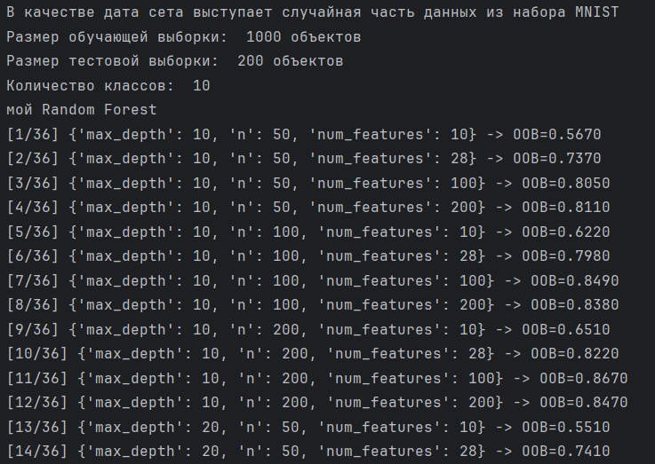
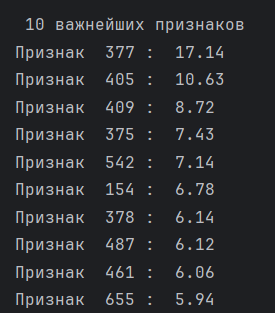
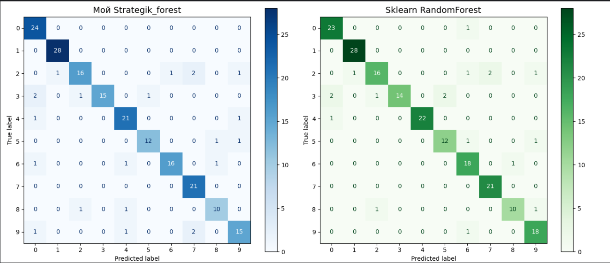
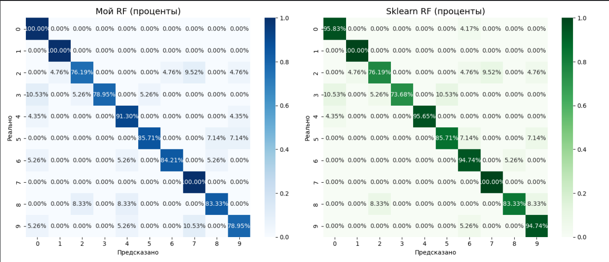
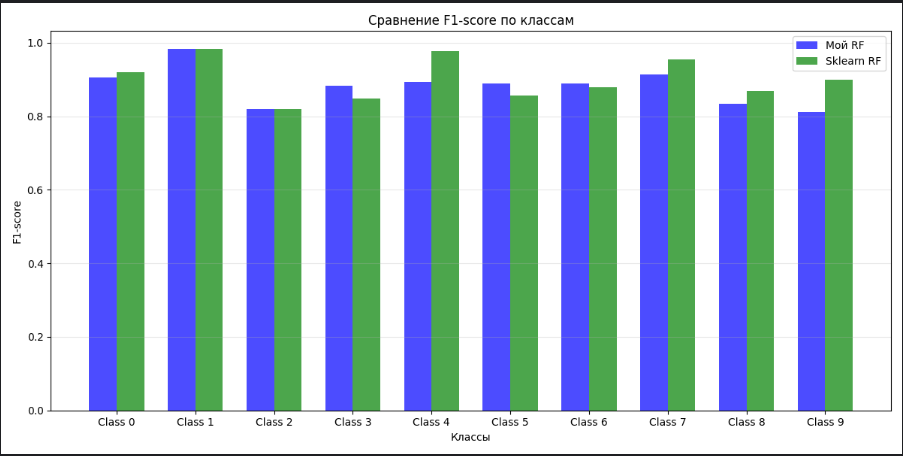
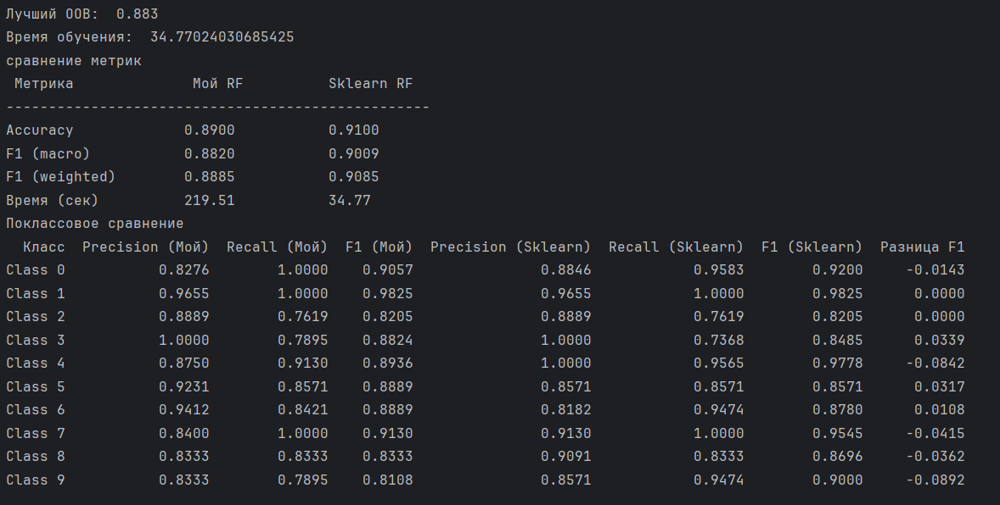

Лабораторная работа №1. Ансамбли моделей.
1)	Был выбран популярный дата сет MNIST, потому что он достаточно прост, чтобы на нем был высокий результат, но так же результат точно будет в зависимости от качества модели, так как предсказать все идеально в MNIST не возможно. 1000 объектов обучающая выборка. 200 объектов тестовая выборка.

2)	Был реализован метод случайных подпространств Random Forest с оценкой по OOB. Был использован свой GridSearch, так как в том, что из библиотеки sklearn оценка производится с помощью кросс валидации, а нам нужно было реализовать именно метод оценки OOB.

3) Я делал выбор вот из таких гиперпараметров.
param_grid_sklearn = {
    'n_estimators': [50, 100, 200],
    'max_depth': [10, 20, None],
    'max_features': [10, 28, 100, 200]
}
   Итоговые идеальные параметры полученные моей моделью это: 200 деревьев, максимальной глубины 20 и 100 признаков в рассмотрение каждому дереву.
   Sklearn модель будет с этим почти согласна. 200 деревьев, максимальная глубина 10, 100 признаков.

Обратил внимание на то, что было выбрано максимальное число деревьев из сетки обеими моделями. Видимо оптимальное число деревьев еще больше, чем 200. Возможно при большем числе деревьев, и количество фич скорректировалось бы до рекомендованного корня из количества признаков, что здесь представлено числом 28.

4)

Самые важные признаки, которые являются пикселями изображений сами по себе, конечно не сообщают никакой информации, но расположены все они в центральной вертикале изображения (в той области, где обычно рисуют цифру), так что важность признаков полученная алгоритмом, соответствует здравому смыслу.

5) Результаты сравнения реализованного мной и библиотекой sklearn случайного леса можно просмотреть на графиках

6) Вывод, мой алгоритм немного уступает реализованному в библиотеке sklearn по метрикам. Разница между 1-2 %. По времени самописный алгоритм проигрывает в 7-8 раз.

