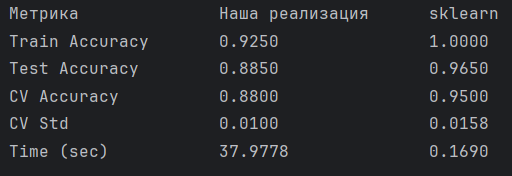

Лабораторная работа №1. Градиентный бустинг.
1)	Был выбран дата сет MNIST, а именно 2 цифры из него для бинарной классификации. 4 и 5, которым были присвоены метки -1 и 1. 200 обучающих примеров и 200 тестовых.

2)	Был реализован алгоритм градиентного бустинга. Сначала написан базовый алгоритм решающего пня, дерево глубины 1, выбирающий признак и порог разделения данных по этому признаку, минимизирующий MSE ошибки на данных при разбиении. Так же реализован сам алгоритм итеративного построения ансамбля градиентного бустинга.

3) Модель была обучена на 200 примерах с параметрами:
Количество деревьев: 50
Скорость обучения (learning_rate): 0.1
Базовые алгоритмы: решающие пни (глубина 1)
   
4)	Для оценки стабильности модели была проведена 5-кратная стратифицированная кросс-валидация на обучающей выборке. Это позволило получить более надежную оценку качества, чем просто разделение на train/test.

5) Для сравнения использовалась GradientBoostingClassifier из библиотеки scikit-learn с идентичными параметрами:
n_estimators=50
learning_rate=0.1
max_depth=1

7)
Результаты эталонной библиотеки примерно на 5% лучше наших. Но при этом обе релизации, даже всего на 200 данных близки к 1 по основным метрикам. Основное различие в скорости обучения.
